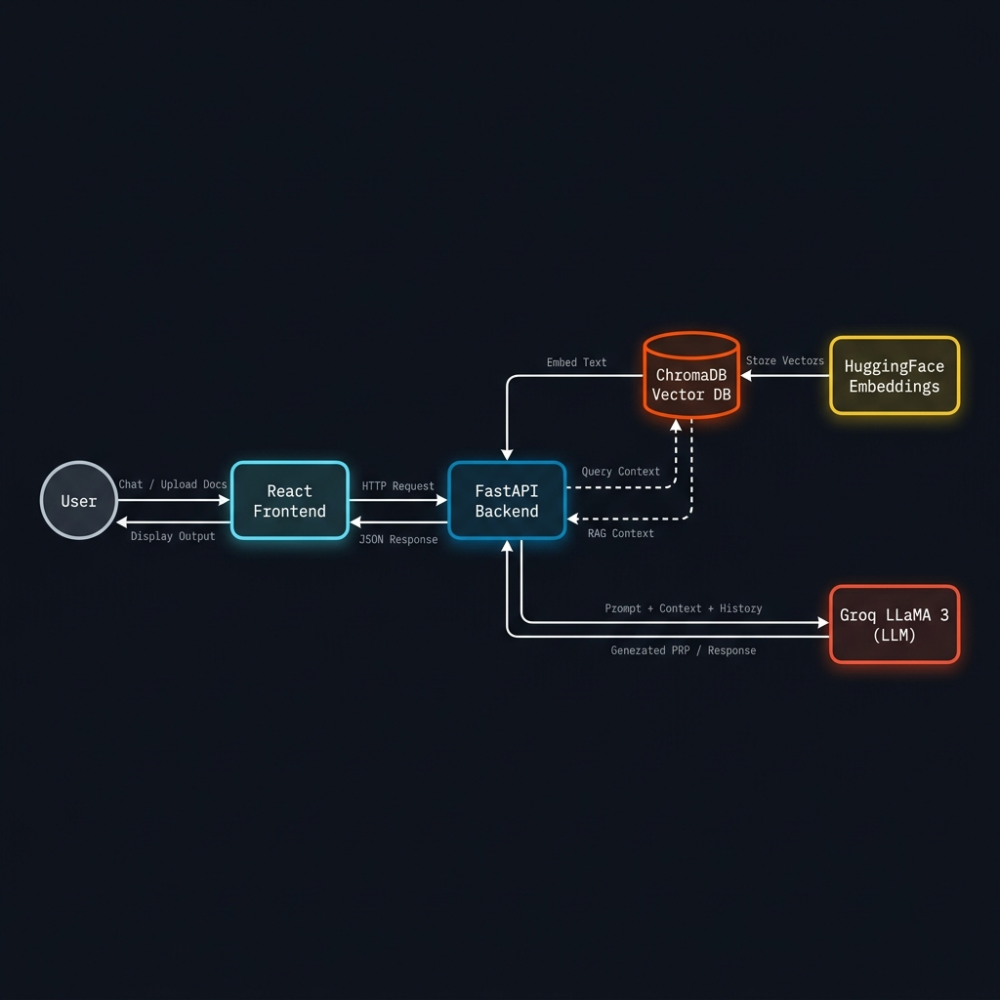

<div align="center">
  <h1>🚀 PRPFIY.ai</h1>
  <p><strong>Agentic AI SaaS for Automated Product Requirement Prompts (PRPs)</strong></p>
  
  <p>
    <a href="https://fastapi.tiangolo.com/"></a>
    <a href="https://reactjs.org/"></a>
    <a href="https://www.trychroma.com/"></a>
    <a href="https://groq.com/"></a>
    <a href="https://python.org"></a>
  </p>
</div>

---

## 📖 Overview

**PRPFIY.ai** is an advanced Agentic AI platform designed for Product Managers, Developers, and System Architects. It leverages cutting-edge LLMs (via Groq API) and Retrieval-Augmented Generation (RAG) to instantly transform raw ideas and uploaded context into highly structured **Product Requirement Prompts (PRPs)**.

Instead of writing vague prompts, PRPFIY uses established industry frameworks (RTCFR, CRISPE, COSTAR, etc.) to ensure your prompts capture the full scope of your product requirements.

## 🔄 System Architecture & Data Flow



> **Flow Summary:** The user interacts with the React frontend, which communicates with the FastAPI backend via HTTP. Uploaded documents are embedded using HuggingFace and stored persistently in ChromaDB. On each chat/PRP request, the backend retrieves relevant context (RAG), combines it with chat history, and sends a structured prompt to Groq's LLaMA 3 for generation. The response is returned and displayed to the user.

## ✨ Key Features

- **🧠 Dual-Mode Chat Interface**
  - **Conversational AI:** Chat naturally to brainstorm ideas and clarify concepts.
  - **PRP Generation Mode:** Effortlessly generate structured PRPs using one of 9 embedded frameworks.
- **📄 RAG & Document Context**
  - Upload PDF, DOCX, TXT, or Markdown documents.
  - The embedded ChromaDB vector database persistently stores and retrieves context to make your PRPs hyper-aware of your business logic.
- **🏗️ 9+ Built-in Prompting Frameworks**
  - Includes **RTCFR, RTF, CRISPE, COSTAR, TASK-SPEC, A-I-C, SPAR, CoT (Chain of Thought)**, and **ReAct**.
- **⚡ Blazing Fast Generation**
  - Powered by **Groq**'s ultra-low latency LPU engine running LLaMA 3.

---

## 🛠️ Technology Stack

### Backend
- **Framework:** FastAPI
- **AI/LLM Routing:** LangChain & Groq (`llama-3.3-70b-versatile`)
- **Vector Database:** ChromaDB (Persistent Storage)
- **Embeddings:** HuggingFace `all-MiniLM-L6-v2`
- **Document Processors:** `pypdf`, `python-docx`

### Frontend
- **Framework:** React + Vite
- **Language:** TypeScript
- **Styling:** Tailwind CSS + shadcn-ui

---

## 🚀 Quick Start Guide

### Prerequisites
1. **Node.js** (v18+) - [Download](https://nodejs.org/)
2. **Python** (3.10+) - [Download](https://python.org/)
3. **Groq API Key** - [Get free key](https://console.groq.com/)

### 1. Start the Backend

Open Terminal 1:

```bash
# Navigate to the backend directory
cd backend

# Create and activate a virtual environment
python -m venv .venv
.\.venv\Scripts\activate      # Windows
# source .venv/bin/activate   # Mac/Linux

# Install dependencies
pip install -r requirements.txt

# Configure Environment Variables
# Create a .env file inside /backend and add:
# GROQ_API_KEY=gsk_your_api_key_here

# Start the FastAPI server
python main.py
```
> **Expected Output:** `INFO: Uvicorn running on http://0.0.0.0:8000`

### 2. Start the Frontend

Open Terminal 2:

```bash
# Navigate to the frontend directory
cd frontend

# Install dependencies
npm install

# Start development server
npm run dev
```
> **Expected Output:** `VITE ready at http://localhost:8080`

### 3. Open the App
Navigate your browser to **http://localhost:8080**.

---

## 💡 How to Use

1. **Setup API Key:** Click the ⚙️ Settings icon in the sidebar and insert your Groq API Key if you haven't set it in `.env`.
2. **Upload Context:** Click the 📎 paperclip icon to upload any project requirements or design specs.
3. **Generate PRP:** 
   - Click the ✨ **"Generate PRP"** button.
   - Select your preferred framework from the dropdown.
   - Describe what you want to build and hit Enter.
   - The AI will evaluate your chat history and uploaded context to generate a strictly formatted PRP.

---

## 🐛 Troubleshooting

| Error | Solution |
|-------|----------|
| **App Not Loading / Blank Screen** | Open browser console (F12) and run: `localStorage.clear(); location.reload();` |
| **net::ERR_CONNECTION_REFUSED** | Backend isn't running. Ensure Terminal 1 shows Uvicorn running. |
| **Groq API Key Not Configured** | Provide your key in the App Settings (⚙️) or in `backend/.env`. |
| **ModuleNotFoundError (Python)** | Ensure you have activated your `.venv` and run `pip install -r requirements.txt`. |

---

## 📝 License

This project is licensed under the MIT License.
